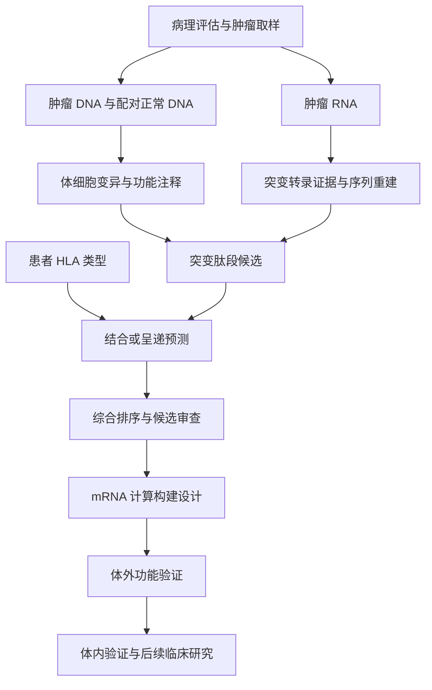

# 癌症治疗性 mRNA 疫苗：从基础概念到真实数据研究

整理日期：2026-10-03
文档版本：0.2.0
来源对话：ChatGPT「mRNA疫苗筛选与验证」（会话 ID：6abf0124-50a8-83e8-9dcb-18ed8b557cbc）
用途：GitHub 研究笔记、后续复现计划和证据追踪基础。

## 1. 研究目标与当前进度

本次学习围绕一个问题展开：**如何从癌症患者的肿瘤组织与测序数据，筛出值得验证的新抗原，并形成治疗性 mRNA 疫苗候选设计？**

当前已经完成概念学习、工作流梳理和公开案例来源核实；仓库另有 [B16-F10 实际证据追踪](b16-f10-first-variant-walkthrough.md)，记录 RNA reads 审计、局部翻译核对与实际 MHC 模型预测。本次整理没有重新运行该分析。Pt02 原始数据分析、候选排序复现、完整 Vaxrank 构建与实验验证尚未完成。下文中的 Pt02“真实输出”指公开开发者报告中的结果，不是本研究独立生成的结果。

治疗性疫苗旨在帮助免疫系统识别已有肿瘤，与预防感染及其相关癌症的疫苗用途不同。[NCI：癌症治疗性疫苗](https://www.cancer.gov/about-cancer/treatment/types/immunotherapy/cancer-treatment-vaccines)

## 2. 对话中的学习过程

| 阶段 | 核心问题 | 形成的认识 |
| --- | --- | --- |
| 基础概念 | 表达、抗原、抗体分别是什么？ | mRNA 是编码信息；抗原是免疫识别对象；抗体是免疫系统产生的一类识别分子 |
| 机制理解 | mRNA 如何引发免疫反应？ | 需要经过递送、翻译、抗原加工与呈递，再形成免疫反应 |
| 聚焦癌症 | 癌细胞有哪些可利用的差异？ | 部分肿瘤突变会产生新的蛋白片段，可作为新抗原候选 |
| 计算筛选 | 如何从大量突变中缩小范围？ | 联合肿瘤/正常 DNA、肿瘤 RNA、患者 HLA 和其他证据排序 |
| 验证闭环 | 预测好是否代表有效？ | 计算、体外、体内与人体研究回答不同层次的问题 |
| 真实案例 | GitHub 上能看到什么？ | Hugo/IPRES Pt02 的 LENS 报告被用于 Vaxrank 的 mRNA 计算构建示例 |
| 后续研究 | 如何亲自理解每一步？ | 先跑小型示例，再追踪 Pt02 报告，最后考虑原始数据复现 |
| 系统学习 | 需要哪些课程、书与技能？ | 先补细胞与免疫学，再学癌症基因组分析、新抗原筛选和 mRNA 工程 |

这是按主题整理的学习过程，不是逐字对话记录。早期关于病原体、中和抗体和群体覆盖率的讨论提供了基础，但不能原样套用到个体化癌症新抗原筛选。

## 3. 基础概念：表达、抗原、抗体与 T 细胞

### 3.1 “表达”需要说明测量层级

基因表达包括遗传信息被转录为 RNA，以及编码 RNA 被翻译为蛋白的过程。研究中说“表达高”时，应明确指 RNA 丰度、突变等位基因的 RNA 支持，还是实际蛋白水平。

```text
DNA 中有突变
    → 突变 RNA 被转录
    → 突变蛋白被翻译
    → 蛋白加工成肽段
    → 肽段在 HLA 上呈递
```

这些环节需要分别取证。RNA-seq 支持突变转录，不直接证明蛋白存在，更不能直接证明细胞表面呈递。

### 3.2 抗原与抗体

- **抗原（antigen）**：能被免疫受体识别的对象；在本课题中重点关注肿瘤来源的蛋白及其肽段。
- **表位（epitope）**：抗原上被特定免疫受体识别的部分。
- **抗体（antibody）**：由 B 细胞分化形成的浆细胞分泌的免疫球蛋白，可结合相应抗原。
- **新抗原（neoantigen）**：在本课题的经典突变路线中，指肿瘤特异性序列改变形成的抗原；计算阶段更准确地称为“候选新抗原”。

抗原不会简单地“变成抗体”。mRNA 编码抗原；免疫系统可能随后产生抗体和/或 T 细胞反应。

### 3.3 癌症新抗原疫苗的关键识别路线

经典 T 细胞受体识别的是**肽段–HLA 复合物**。HLA 是人类的主要组织相容性复合体：HLA-I 主要涉及 CD8 T 细胞识别，HLA-II 主要涉及 CD4 T 细胞识别。两类路线都值得关注，不能将所有抗肿瘤免疫简化为抗体反应。

mRNA 疫苗的教学主线是：抗原呈递细胞摄取并翻译 mRNA，呈递抗原片段并启动 T 细胞反应；相应 T 细胞随后需要识别肿瘤细胞上天然呈递的靶点。[NCI：mRNA 疫苗如何帮助治疗癌症](https://www.cancer.gov/news-events/cancer-currents-blog/2022/mrna-vaccines-to-treat-cancer)

### 3.4 mRNA 疫苗基础：临时说明书与递送

mRNA 是信使 RNA，可以把它理解为“临时生产说明书”：递送系统帮助它进入细胞并释放到胞质，核糖体读取编码区，制造目标蛋白；随后 RNA 会被降解。常规 mRNA 疫苗的作用不需要进入细胞核或改写基因组。它通常编码抗原，而不是直接把抗体注射进去。

常见设计包含 5′端帽、5′UTR、开放阅读框（ORF）、3′UTR 和 poly(A)。其中 ORF 决定蛋白序列，其余元件参与稳定性与翻译调控。核苷修饰、体外转录（IVT）、纯化及递送是不同的工程环节；LNP 是常见递送方式，但癌症 RNA 疫苗也有其他制剂路线。不能从核酸序列文件推断这些实体属性。[Pardi et al., 2018](https://pubmed.ncbi.nlm.nih.gov/29326426/)

预防感染时可能关注中和抗体、T 细胞及保护效果；癌症新抗原研究更关注能否诱导识别天然肿瘤靶点的 T 细胞。两者都需要功能证据：表达高、抗体结合强或预测分数高，分别只支持因果链中的一部分。

### 3.5 mRNA 在癌症中的应用

| 方向 | 编码内容与研究目的 | 与本课题的关系 |
| --- | --- | --- |
| 个体化新抗原疫苗 | 患者特异的突变抗原，扩大相应 T 细胞反应 | 本笔记的主要路线 |
| 共享肿瘤抗原疫苗 | 多位患者共有的肿瘤相关抗原 | 仍需考虑 HLA、耐受和正常组织表达 |
| 免疫刺激蛋白 | 细胞因子等免疫调节分子 | 调整免疫环境，不等同于新抗原选择 |
| 抗体或治疗蛋白 | 让细胞短暂生产治疗性蛋白 | 是 mRNA 治疗应用，未必属于疫苗 |
| 细胞治疗辅助 | 通过 mRNA 暂时赋予免疫细胞受体等功能 | 需单独评估细胞功能与持续时间 |

这些方向有不同的研究与临床证据，不能因为使用 mRNA 就认为已证明安全有效。关于免疫调节、抗体表达与癌症疫苗路线，可从 [Pardi 等综述](https://pubmed.ncbi.nlm.nih.gov/29326426/) 入手；本文不提供截至整理日期的审批状态清单。

疫苗希望启动或扩大靶向抗原的反应；PD-1/PD-L1 等检查点抑制策略希望减轻部分免疫抑制，因此有联合研究的逻辑，但两者均不能自动克服所有免疫逃逸。[NCI：癌症 mRNA 疫苗](https://www.cancer.gov/news-events/cancer-currents-blog/2022/mrna-vaccines-to-treat-cancer)

### 3.6 HLA 与 T 细胞：展示、识别和激活是三件事

HLA 可以比作“展示架”，肽段是展示内容，TCR 是识别肽–HLA 组合的受体。患者 HLA 等位基因不同，同一肽的呈递机会也可能不同。HLA-I 通常呈递较短肽段并涉及 CD8 T 细胞；HLA-II 可呈递较长肽段并涉及 CD4 T 细胞。疫苗编码的长抗原窗口与最终展示的表位并不是同一个长度概念。

启动初始 T 细胞通常还需要抗原呈递细胞提供共刺激与适当信号。肿瘤靶细胞是否保留 HLA、是否天然呈递对应肽，以及 T 细胞能否进入肿瘤并发挥功能，都是后续独立问题。仅测肽–HLA 结合，不能替代这些问题的验证。[MIT：细胞与分子免疫学课程](https://ocw.mit.edu/courses/hst-176-cellular-and-molecular-immunology-fall-2005/)

## 4. “从癌症切片开始”的准确含义

H&E 病理图像或全切片图像（WSI）可以帮助确认肿瘤、圈定取样区域和评估肿瘤含量，但图像本身不能提供患者特异的突变序列和 HLA 类型。

本研究采用的经典数据路线需要肿瘤 DNA、配对正常 DNA 和肿瘤 RNA，并核实样本属于同一患者及适当时间点。具体样本是否配套、是否公开可下载，必须查元数据，不能凭文件名推断。



此图是研究逻辑，不代表已经取得 Pt02 的病理图像或逐级完整数据。

## 5. 新抗原计算筛选：每一步回答什么

| 步骤 | 主要输入 | 要回答的问题 | 典型输出与限制 |
| --- | --- | --- | --- |
| 样本核对与质控 | 样本表、FASTQ、实验信息 | 配对正确吗？数据质量足够吗？ | 数据清单和质控报告；质量不足会影响下游判断 |
| 比对 | DNA/RNA reads、参考序列 | reads 来自哪些位置？ | BAM/CRAM；DNA 与 RNA 使用适合各自数据的比对流程 |
| 体细胞变异检测 | 肿瘤与正常 DNA 比对结果 | 哪些变化支持肿瘤体细胞来源？ | 过滤后的 VCF；不是简单做字符串相减 |
| 功能注释 | VCF、转录本注释 | 是否改变编码序列？改变哪个转录本？ | 蛋白改变、转录本和坐标信息 |
| RNA 支持与重建 | 肿瘤 RNA 比对结果 | 突变等位基因是否被转录？周围序列是什么？ | 支持 reads、局部突变转录本与翻译序列 |
| 候选肽生成 | 突变蛋白序列 | 哪些片段包含序列改变？ | 肽段列表；一个突变可对应多个肽 |
| HLA 分型及预测 | 患者 HLA、肽段 | 哪些肽–HLA 配对值得关注？ | 结合/呈递分数；不同模型指标不能混为一谈 |
| 综合排序 | 上述结果和补充证据 | 哪些候选最值得实验？ | 排序表、保留/排除原因与证据缺口 |

优先审查的证据包括：变异可信度、突变 RNA 支持、候选序列与正常序列的差异、预测呈递能力、正常组织相关风险，以及可获得的克隆性、HLA 丢失和免疫逃逸信息。哪些指标被工具实际使用，必须查所固定版本的实现；工具未计算的指标应单独标注。

必须保留的解释边界：

- 基因有 RNA 表达，不代表突变等位基因一定被表达。
- 未发现 RNA 支持，也可能由测序深度或取样限制导致，不能直接证明绝对不表达。
- 强 HLA 结合预测，不保证天然加工、呈递或 T 细胞识别。
- 突变肽比野生型结合更强不是所有新抗原的必要条件；T 细胞识别差异也很重要。
- 参考蛋白组筛查可减少明显自身序列问题，但不能排除全部交叉反应。
- HLA-I 短肽、HLA-II 肽和疫苗编码的较长抗原窗口是不同对象，不应套用统一长度。

对话中的“数千突变 → 数百表达候选 → 数十优先候选”用于解释筛选漏斗，**不是 Pt02 实测统计**。后续必须从实际运行日志记录每级数量和排除原因。

## 6. 从候选抗原到 mRNA 设计

概念上，一个多抗原 mRNA 设计可以包含：

```text
5′端帽 — 5′UTR — 编码区（抗原窗口、连接区及可选功能元件）— 3′UTR — poly(A)
```

需要分别考虑抗原顺序、连接区产生的非预期表位、编码区翻译一致性，以及 RNA 稳定性、翻译和递送。密码子或 RNA 结构优化属于设计探索；单一 GC 含量或最低自由能指标不等于有效性评分。

FASTA 文件表达的是序列设计。它不包含实体制剂的全部属性，例如端帽化学状态、核苷修饰、纯度、完整性、递送制剂及制造质量。以 A/C/G/T 表示的核酸设计序列也不代表已经制成 RNA。

## 7. 验证链：in silico → in vitro → in vivo

| 层级 | 核心问题 | 可考虑的证据 | 能支持的结论 |
| --- | --- | --- | --- |
| In silico：计算 | 序列与候选选择是否有依据？ | 变异、RNA 支持、HLA 预测、构建审查 | 候选合理，值得进一步验证 |
| In vitro：表达 | 构建能否产生预期产物？ | RNA/蛋白身份、表达、定位或加工检测 | 在所测试细胞体系中表达符合预期 |
| In vitro：呈递 | 目标肽是否实际出现在 HLA 上？ | 免疫肽组学或适当呈递检测 | 支持天然呈递；阴性仍需考虑检测灵敏度 |
| In vitro：识别 | T 细胞能否识别目标？ | 抗原特异性、细胞因子、增殖等功能读出 | 在该体系中存在识别或激活 |
| In vitro：肿瘤功能 | 能否识别和杀伤真实肿瘤细胞？ | 与 HLA 匹配的肿瘤靶细胞反应及正常细胞对照 | 支持抗肿瘤功能并初步评估特异性 |
| In vivo：体内 | 是否形成有效且可耐受的抗肿瘤反应？ | 适当模型中的免疫反应、肿瘤结局和安全性 | 在该模型和条件下有体内证据 |
| 人体研究 | 对患者是否安全并有临床获益？ | 合规临床研究中的安全性与临床终点 | 仅能按具体研究设计和结果解释 |

人工外加肽引发 T 细胞反应，不能替代对天然表达肿瘤的识别验证。由已知反应性 T 细胞证明“可识别”，也不等于疫苗能够有效诱导这类 T 细胞。

“蛋白折叠正确”对依赖构象的抗体表位很重要；对以 T 细胞肽表位为目标的构建，应重点检查身份、加工、呈递和功能，不能把完整天然蛋白折叠设为所有设计的统一门槛。

Go/No-Go 标准应事先按模型、检测能力和研究目的定义，而不是事后选择有利结果；此笔记不虚构通用数值阈值。动物模型的 MHC/HLA、免疫背景及肿瘤模型限制也必须记录。

## 8. 真实案例：Hugo/IPRES Pt02 → LENS → OpenVax/Vaxrank

### 8.1 三个独立来源层次

**原始患者研究。** Hugo 等在 Cell 发表研究，分析转移性黑色素瘤的突变组与转录组，探索抗 PD-1 治疗应答及耐药相关特征，提出 IPRES。该研究不是 Pt02 mRNA 疫苗疗效试验。队列包含少量治疗早期样本，因此具体 Pt02 取样时间需要查样本元数据，不能仅据队列简介确定。[Hugo et al., 2016](https://pmc.ncbi.nlm.nih.gov/articles/PMC4808437/)

GEO 的 [GSE78220](https://www.ncbi.nlm.nih.gov/geo/query/acc.cgi?acc=GSE78220) 提供相关转录组研究入口。表达矩阵不等于突变位点 reads，也不意味着该入口提供完整配对 DNA 数据；原始测序及 Pt02 映射仍需逐项确认。

**上游分析软件。** LENS 是肿瘤抗原分析工作流，RAFT 支持其组织与运行。LENS 涵盖的来源超出经典点突变路线，包括其他肿瘤抗原来源，不能将报告每一行都称为独立突变新抗原。[LENS 论文](https://pmc.ncbi.nlm.nih.gov/articles/PMC10246587/)

**后续 GitHub 设计示例。** Vaxrank 项目 Issue #270 记录了使用 Pt02 LENS 报告进行 mRNA 构建的开发者运行。这是将患者数据衍生报告用于计算设计的证据，不是患者接种或治疗获益的证据。[Vaxrank Issue #270](https://github.com/openvax/vaxrank/issues/270)

### 8.2 Pt02 公开运行记录中的内容

Issue #270 于 2026-05-05 描述 Vaxrank 2.17.0 的运行：

| 项目 | 开发者记录 |
| --- | --- |
| 输入报告 | `HugoLo_IPRES_2016-Pt02-ad-839+ar-280+nd-840.lens-v1.9-dev.report.tsv` |
| 输入规模 | 2153 条 epitope predictions；不是 2153 个独立抗原或突变 |
| 示例构建 | `seq_001`，其 FASTA 标头报告 `length=1203` |
| 标头中的五个来源基因 | SIAH2、TAOK1、R3HDM1、CPSF7、KMT2B |
| 当时输出文件 | `cds.fasta`、`no_polyA.fasta`、`full.fasta`、`manifest.json`、`layers.csv` |

这些基因名用于定位候选来源；完整候选身份还需要突变、转录本、肽序列和 HLA。不能据此认定整个基因是疫苗靶点，也不能假定最新版本一定生成相同组合。1203 的具体组成应对照原始 FASTA 和 manifest 核实。[运行记录与输出说明](https://github.com/openvax/vaxrank/issues/270)

### 8.3 Vaxrank 的职责与两条入口

Vaxrank 支持从体细胞变异、肿瘤 RNA 与患者 HLA 开始的候选排序，也支持使用 LENS/pVACseq 等预计算报告。当前仓库列出 mRNA 序列输出功能；实际参数和输出以固定版本为准。[OpenVax/Vaxrank](https://github.com/openvax/vaxrank)

```text
入口 A：体细胞 VCF + 肿瘤 RNA BAM + 患者 HLA
        → RNA 支持的候选与预测 → 排序 → 构建

入口 B：预计算 LENS 报告
        → 报告适配与候选排序 → 构建
```

入口 B 不能声称重新完成了原始 FASTQ、变异检测或全部 RNA 重建。Vaxrank 也不能代替病理评估、配对样本测序与上游体细胞变异检测。

### 8.4 复现前的检查点

1. 核对 Pt02 在论文、数据仓库、RAFT manifest 与 LENS 报告中的身份映射。
2. 记录参考基因组、转录本注释和 HLA 来源；此前对话中的 GRCh38 是教学举例，不是已确认的 Pt02 数据版本。
3. 确认报告能否实际取得，并记录来源、许可和校验值；Issue 中列出文件名不等于提供可下载文件。
4. 区分报告行、肽–HLA 配对、独立肽、抗原来源和构建数量。
5. 固定代码版本、预测模型与参数；报告旧版结果与新版行为的差异。

RAFT 文档列出 `HugoLo_IPRES_2016` 下载与运行入口，但本次没有实际验证文件完整性、访问要求或 Pt02 数据配对情况。[RAFT 数据准备文档](https://useraft.io/en/v1.5.2/datasets.html)

## 9. 实践路线图与完成标准

### 阶段一：小型黑色素瘤示例，学习数据结构

从固定 Vaxrank 版本提供的 B16-F10 示例入手，先确认该版本实际示例文件与使用说明。它是小鼠案例：使用小鼠 MHC，不能把结果直接外推为人类 HLA 或 Pt02 结论。

任务：解释一条 VCF 记录；核对相应 RNA 支持；追踪突变蛋白、候选肽、预测分数与排序结果。区分测试用随机预测器与真实生物学预测器：前者只能验证软件流程。

**完成标准：** 保存版本与命令、输入校验值、日志及一条候选的完整证据追踪；能解释为什么保留或排除。仓库已有 [局部证据追踪](b16-f10-first-variant-walkthrough.md)，但完整 Vaxrank 排序与构建仍待完成；本次没有重新验证其运行产物。

### 阶段二：Pt02 预计算报告，复现报告到构建

先取得并核实真实报告，再核对列定义、缺失值和候选来源类别。选择一个候选逐列阅读，并运行与报告兼容的固定 Vaxrank 版本。

**完成标准：** 生成可审查排序表和构建清单；统计筛选数量；核对翻译序列与各元件边界；比较与 Issue #270 的一致或差异并解释。若拿不到报告，应明确记录缺口，不以模拟报告替代真实复现。尚未完成。

### 阶段三：原始测序数据，复现上游分析

先建立样本 manifest，确认下载权限、存储、计算资源和工具许可，再下载选定患者数据。运行质控、比对、变异检测、RNA 支持及 HLA 相关流程；全部使用一致参考体系。

**完成标准：** 从原始数据追踪至少一个候选到排序结果；保存质控指标、各级计数、参数和失败原因；说明与公开报告不同的可能来源。重新分析不必逐字重现旧结果，但应能够解释差异。尚未完成。

### 阶段四：实验与转化问题清单

在计算证据清楚后，与具备条件的研究团队制定表达、呈递、T 细胞功能、天然肿瘤识别和正常细胞交叉反应验证计划，再讨论适当体内模型。

**完成标准：** 有明确假设、对照、终点和预先定义的决策标准；把证据缺失记录为缺失。当前只建立问题框架，不声称已获功能或临床证据。

## 10. GitHub 研究记录建议

建议将此文件作为 `docs/cancer-mrna-vaccine-research-notes.md`，在 README 中链接。最小组织方式如下，可随真实产物逐步建立：

```text
README.md
docs/cancer-mrna-vaccine-research-notes.md
metadata/sample-manifest.tsv
metadata/provenance.tsv
results/candidate-evidence.tsv
results/run-summary.md
```

`provenance.tsv` 记录数据链接、访问日期、样本、参考版本、许可及校验值。运行总结记录软件 tag/commit、预测模型、参数、环境、随机设置（如适用）和各阶段数量。大体积测序文件不放入普通 Git；患者数据按来源访问与再分发要求处理。

每个候选至少记录：样本 ID、抗原来源类别、基因/转录本、参考基因组与变异、突变和野生型序列、RNA 支持、HLA、预测器及分数单位、排序原因、排除原因、实验状态和证据链接。缺失字段标为未知；不要填写推测值。

## 11. 当前待解决的问题

- Pt02 配对样本、取样时间、数据 accession 与报告身份能否完整对应？
- 开发者使用的 LENS 报告及历史代码环境是否能够实际获得？
- 五个候选为何被选中？是否受抗原数量或长度上限影响？
- 报告中不同来源类别是否在所用 Vaxrank 版本得到完整处理？
- 构建中每段序列和预测表位如何对应？是否产生新的连接区表位？
- 是否存在这些具体候选的天然呈递、T 细胞功能或肿瘤杀伤证据？本次尚未建立这些证据。

**近期最有价值的动作：在已有 B16-F10 局部证据基础上补全排序与构建追踪，再取得 Pt02 报告。**

## 12. 推荐课程、书籍与学习路线

### 12.1 按问题学习，而不是堆积工具名称

| 模块 | 需要理解的内容 | 学习完成后的可检查产物 |
| --- | --- | --- |
| 细胞、分子生物学与遗传学 | DNA/RNA/蛋白、转录、翻译、剪接、突变和信号传导 | 画出表达链，解释 RNA 与蛋白证据的区别 |
| 免疫学 | 先天/适应性免疫、B/T 细胞、HLA、TCR、树突细胞、耐受与检查点 | 解释 HLA 结合、呈递、T 细胞识别和激活的区别 |
| 癌症生物学 | 癌基因、抑癌基因、驱动/乘客突变、克隆演化、异质性与微环境 | 解释候选靶点为何可能被肿瘤丢失或绕过 |
| 生物信息学与统计 | Linux、Python、Git、R、质控、假设检验和多重比较 | 能阅读 FASTQ、BAM、VCF、FASTA 与注释文件 |
| 癌症基因组学 | 配对肿瘤/正常变异检测、RNA 支持、转录本、拷贝数与纯度 | 追踪一条变异的参考体系与证据来源 |
| 新抗原与 mRNA 工程 | HLA 分型、预测与排序、UTR/ORF、递送和功能验证 | 完成一个候选的证据表及构建审查表 |

结构生物学和机器学习适合作为后续选修：先理解蛋白结构、PDB/PyMOL 和模型评估，再考虑结构预测、对接或分子动力学。AlphaFold、对接分数与 RNA 最低自由能都不能单独证明免疫原性或临床有效性。

### 12.2 课程入口

| 课程 | 用途与建议学习顺序 |
| --- | --- |
| [MIT 7.016 Introductory Biology](https://ocw.mit.edu/courses/7-016-introductory-biology-fall-2018/resources/lecture-videos/) | 起步补细胞、遗传和生化；再看癌症与免疫学讲次 |
| [MIT 7.28x Molecular Biology](https://ocw.mit.edu/courses/res-7-008-7-28x-molecular-biology/) | 深入转录、RNA 加工与翻译，理解表达证据 |
| [MIT HST.176 Cellular and Molecular Immunology](https://ocw.mit.edu/courses/hst-176-cellular-and-molecular-immunology-fall-2005/) | 学抗原加工、MHC 与免疫受体；属于历史课程，前沿内容需补读论文 |
| [Johns Hopkins：Genomic Data Science](https://www.coursera.org/specializations/genomic-data-science) | 补测序数据、命令行、Python/R 和统计分析 |
| [UC San Diego：Bioinformatics](https://www.coursera.org/specializations/bioinformatics) | 偏序列分析与算法，适合已有编程基础后学习 |

上述是课程官网入口，不保证特定日期的免费权限、证书价格或开课形式；按知识缺口选模块，不必全部学完。

### 12.3 书单与阅读重点

建议首先使用以下五本，阅读顺序属于学习建议，不是必须购买的清单。细胞生物学、Janeway 与癌症教材可从 [Norton 生物学教材目录](https://wwnorton.co.uk/subjects/textbooks/biological-sciences) 核对；章节编号随版本变化，按主题查目录。

| 顺序 | 书籍 | 优先阅读内容 |
| --- | --- | --- |
| 1 | *Essential Cell Biology* — Alberts 等 | DNA、RNA、蛋白、基因表达、细胞信号 |
| 2 | [*Cellular and Molecular Immunology* — Abbas、Lichtman、Pillai](https://shop.elsevier.com/books/cellular-and-molecular-immunology/abbas/978-0-323-75748-5) | 抗原呈递、T 细胞激活、耐受、肿瘤免疫 |
| 3 | *Janeway’s Immunobiology* | 深入抗原识别、MHC、B/T 细胞及免疫调控 |
| 4 | *The Biology of Cancer* — Robert A. Weinberg | 癌症基因、演化、异质性、微环境与免疫逃逸 |
| 5 | [*Bioinformatics Algorithms* — Phillip Compeau、Pavel Pevzner](https://www.bioinformaticsalgorithms.org/) | 序列比对、组装及算法思维，配合习题实践 |

进阶参考可以用 *Molecular Biology of the Cell*（Alberts 等）；原对话也提及 Robert F. Weaver 的 *Molecular Biology*，可作为转录、翻译主题补充，不必与入门书同时通读。第一次学习免疫学可先读 Abbas，再用 Janeway 深入。

mRNA 工程部分优先读综述与方法论文：[Pardi et al., 2018](https://pubmed.ncbi.nlm.nih.gov/29326426/) 用于建立技术全景；[Sahin et al., 2017](https://www.nature.com/articles/nature23003) 是个体化 RNA 新抗原疫苗的人体研究入口。后者与 Hugo/IPRES 数据再分析是不同研究。读论文时分别摘录样本量、疫苗平台、免疫读出、临床终点及设计限制；早期免疫反应证据不能单独证明普遍临床获益。

### 12.4 与真实数据并行的阶段路线

以下时间只作安排参考，按已有背景调整，不代表可在该时间内获得独立研发资格。

1. **基础阶段，约 2–4 周：** 读 Essential Cell Biology 与 Abbas 的相关主题，画出 DNA → RNA → 蛋白 → 肽–HLA → TCR 的链条；逐项说明什么证据还缺失。
2. **数据阶段，约 1–2 个月：** 学 Linux、Python（pandas、NumPy、绘图、Biopython/pysam）、Git 和基础统计；读懂 FASTQ/FASTA、SAM/BAM、VCF、BED、GTF/GFF。同时阅读 Weinberg 的突变、演化与免疫逃逸主题。
3. **上游分析阶段，约 1–2 个月：** 在小型、来源明确的数据上理解质控 → DNA/RNA 各自比对 → 体细胞检测 → 注释。可认识 FastQC、BWA、STAR、Samtools、Mutect2 和 VEP；先选一条路线，不必掌握所有替代工具。RNA 表达定量不等同于突变转录本重建。
4. **新抗原阶段：** 沿仓库 B16-F10 记录核对 RNA 证据与肽–MHC 结果；再研究 Vaxrank/pVACtools，以及 HLA 分型和 NetMHCpan/MHCflurry 的适用范围。人类 HLA 与小鼠 MHC 要分开记录。
5. **Pt02 阶段：** 取得真实 LENS 报告并固定版本，从报告列到排序表、mRNA 构建和 manifest 逐项追踪；此阶段不声称重新分析了 FASTQ。
6. **工程与验证阶段：** 学端帽、UTR、ORF、poly(A)、密码子、RNA 结构、核苷修饰、IVT、纯化与递送；依据第 7 节设计表达、天然呈递、T 细胞识别、肿瘤杀伤及正常细胞对照的验证问题。

如果后续选择 AI 方向，再补线性代数、概率统计、优化与 PyTorch。模型评估应按患者或适当独立单位划分数据，防止同源肽和重复样本泄漏；保留独立测试集与基线。目标是解释候选选择是否改善，而不是用一个分数替代生物学验证。

**学习验收：** 拿到一组来源明确的变异、RNA 和 HLA 信息后，能解释一个候选从何而来、为何被保留或排除、能支持哪些结论、哪些环节尚未验证，并保存可追踪产物。读书与实践应交替推进，以实际能力决定节奏。

## 13. 参考资料

原始来源清单于 2026-10-02 建立；2026-10-03 再次核对 Hugo 论文、GEO 入口、Vaxrank 仓库与 Issue #270，并补充课程和书籍官网。数据下载和计算复现未在本次整理中执行。项目网页会变化；实际复现应补充固定 commit 或归档版本。

1. [Hugo et al.：Genomic and Transcriptomic Features of Response to Anti-PD-1 Therapy in Metastatic Melanoma，Cell，2016，DOI: 10.1016/j.cell.2016.02.065](https://pmc.ncbi.nlm.nih.gov/articles/PMC4808437/)
2. [GEO：GSE78220](https://www.ncbi.nlm.nih.gov/geo/query/acc.cgi?acc=GSE78220)
3. [OpenVax/Vaxrank GitHub 仓库](https://github.com/openvax/vaxrank)
4. [Vaxrank Issue #270：Pt02 mRNA 输出运行记录](https://github.com/openvax/vaxrank/issues/270)
5. [Vaxrank 方法预印本，DOI: 10.1101/142919](https://www.biorxiv.org/content/10.1101/142919v2)
6. [LENS 方法论文，Bioinformatics，2023，DOI: 10.1093/bioinformatics/btad322](https://pmc.ncbi.nlm.nih.gov/articles/PMC10246587/)
7. [RAFT：Preparing your samples](https://useraft.io/en/v1.5.2/datasets.html)
8. [LENS：Preparing your samples](https://uselens.io/en/lens-v1.9.0/preparing_your_samples.html)
9. [NCI：Cancer Treatment Vaccines](https://www.cancer.gov/about-cancer/treatment/types/immunotherapy/cancer-treatment-vaccines)
10. [NCI：How mRNA Vaccines Might Help Treat Cancer](https://www.cancer.gov/news-events/cancer-currents-blog/2022/mrna-vaccines-to-treat-cancer)

11. [Pardi et al.：mRNA vaccines — a new era in vaccinology，2018，DOI: 10.1038/nrd.2017.243](https://pubmed.ncbi.nlm.nih.gov/29326426/)
12. [Sahin et al.：Personalized RNA mutanome vaccines mobilize poly-specific therapeutic immunity against cancer，2017，DOI: 10.1038/nature23003](https://www.nature.com/articles/nature23003)

课程与教材的官方入口见第 12 节。

## 14. 版本记录

| 版本 | 日期 | 内容 |
| --- | --- | --- |
| 0.1.0 | 2026-10-02 | 整理学习过程、验证链、Pt02 来源及分阶段研究路线；尚未执行数据复现 |
| 0.2.0 | 2026-10-03 | 补全 mRNA 基础、癌症应用、HLA/T 细胞逻辑、课程书单与学习路线；同步仓库已有 B16-F10 局部分析进度 |
