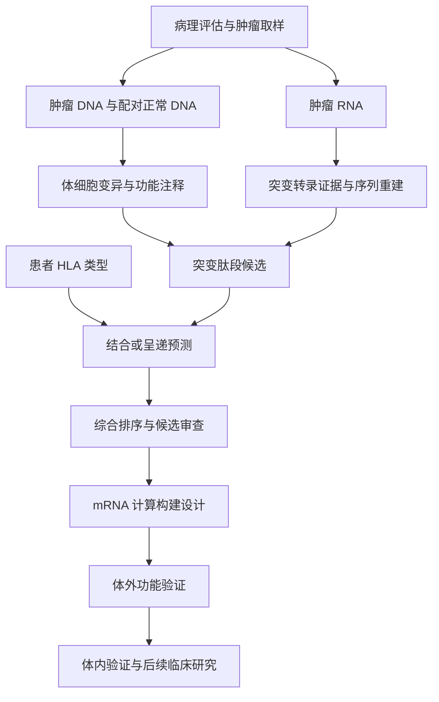

# 癌症治疗性 mRNA 疫苗：从基础概念到真实数据研究

整理日期：2026-10-02
文档版本：0.1.0
来源对话：ChatGPT「mRNA疫苗筛选与验证」（会话 ID：6abf0124-50a8-83e8-9dcb-18ed8b557cbc）
用途：GitHub 研究笔记、后续复现计划和证据追踪基础。

## 1. 研究目标与当前进度

本次学习围绕一个问题展开：**如何从癌症患者的肿瘤组织与测序数据，筛出值得验证的新抗原，并形成治疗性 mRNA 疫苗候选设计？**

当前已经完成概念学习、工作流梳理和公开案例来源核实。尚未下载 Pt02 原始数据、运行分析流程、复现候选排序或开展实验。下文中的“真实输出”指公开开发者报告中的结果，不是本研究独立生成的结果。

治疗性疫苗旨在帮助免疫系统识别已有肿瘤，与预防感染及其相关癌症的疫苗用途不同。[NCI：癌症治疗性疫苗](https://www.cancer.gov/about-cancer/treatment/types/immunotherapy/cancer-treatment-vaccines)

## 2. 对话中的学习过程

| 阶段 | 核心问题 | 形成的认识 |
| --- | --- | --- |
| 基础概念 | 表达、抗原、抗体分别是什么？ | mRNA 是编码信息；抗原是免疫识别对象；抗体是免疫系统产生的一类识别分子 |
| 机制理解 | mRNA 如何引发免疫反应？ | 需要经过递送、翻译、抗原加工与呈递，再形成免疫反应 |
| 聚焦癌症 | 癌细胞有哪些可利用的差异？ | 部分肿瘤突变会产生新的蛋白片段，可作为新抗原候选 |
| 计算筛选 | 如何从大量突变中缩小范围？ | 联合肿瘤/正常 DNA、肿瘤 RNA、患者 HLA 和其他证据排序 |
| 验证闭环 | 预测好是否代表有效？ | 计算、体外、体内与人体研究回答不同层次的问题 |
| 真实案例 | GitHub 上能看到什么？ | Hugo/IPRES Pt02 的 LENS 报告被用于 Vaxrank 的 mRNA 计算构建示例 |
| 后续研究 | 如何亲自理解每一步？ | 先跑小型示例，再追踪 Pt02 报告，最后考虑原始数据复现 |

这是按主题整理的学习过程，不是逐字对话记录。早期关于病原体、中和抗体和群体覆盖率的讨论提供了基础，但不能原样套用到个体化癌症新抗原筛选。

## 3. 基础概念：表达、抗原、抗体与 T 细胞

### 3.1 “表达”需要说明测量层级

基因表达包括遗传信息被转录为 RNA，以及编码 RNA 被翻译为蛋白的过程。研究中说“表达高”时，应明确指 RNA 丰度、突变等位基因的 RNA 支持，还是实际蛋白水平。

```text
DNA 中有突变
    → 突变 RNA 被转录
    → 突变蛋白被翻译
    → 蛋白加工成肽段
    → 肽段在 HLA 上呈递
```

这些环节需要分别取证。RNA-seq 支持突变转录，不直接证明蛋白存在，更不能直接证明细胞表面呈递。

### 3.2 抗原与抗体

- **抗原（antigen）**：能被免疫受体识别的对象；在本课题中重点关注肿瘤来源的蛋白及其肽段。
- **表位（epitope）**：抗原上被特定免疫受体识别的部分。
- **抗体（antibody）**：由 B 细胞分化形成的浆细胞分泌的免疫球蛋白，可结合相应抗原。
- **新抗原（neoantigen）**：在本课题的经典突变路线中，指肿瘤特异性序列改变形成的抗原；计算阶段更准确地称为“候选新抗原”。

抗原不会简单地“变成抗体”。mRNA 编码抗原；免疫系统可能随后产生抗体和/或 T 细胞反应。

### 3.3 癌症新抗原疫苗的关键识别路线

经典 T 细胞受体识别的是**肽段–HLA 复合物**。HLA 是人类的主要组织相容性复合体：HLA-I 主要涉及 CD8 T 细胞识别，HLA-II 主要涉及 CD4 T 细胞识别。两类路线都值得关注，不能将所有抗肿瘤免疫简化为抗体反应。

mRNA 疫苗的教学主线是：抗原呈递细胞摄取并翻译 mRNA，呈递抗原片段并启动 T 细胞反应；相应 T 细胞随后需要识别肿瘤细胞上天然呈递的靶点。[NCI：mRNA 疫苗如何帮助治疗癌症](https://www.cancer.gov/news-events/cancer-currents-blog/2022/mrna-vaccines-to-treat-cancer)

## 4. “从癌症切片开始”的准确含义

H&E 病理图像或全切片图像（WSI）可以帮助确认肿瘤、圈定取样区域和评估肿瘤含量，但图像本身不能提供患者特异的突变序列和 HLA 类型。

本研究采用的经典数据路线需要肿瘤 DNA、配对正常 DNA 和肿瘤 RNA，并核实样本属于同一患者及适当时间点。具体样本是否配套、是否公开可下载，必须查元数据，不能凭文件名推断。



此图是研究逻辑，不代表已经取得 Pt02 的病理图像或逐级完整数据。

## 5. 新抗原计算筛选：每一步回答什么

| 步骤 | 主要输入 | 要回答的问题 | 典型输出与限制 |
| --- | --- | --- | --- |
| 样本核对与质控 | 样本表、FASTQ、实验信息 | 配对正确吗？数据质量足够吗？ | 数据清单和质控报告；质量不足会影响下游判断 |
| 比对 | DNA/RNA reads、参考序列 | reads 来自哪些位置？ | BAM/CRAM；DNA 与 RNA 使用适合各自数据的比对流程 |
| 体细胞变异检测 | 肿瘤与正常 DNA 比对结果 | 哪些变化支持肿瘤体细胞来源？ | 过滤后的 VCF；不是简单做字符串相减 |
| 功能注释 | VCF、转录本注释 | 是否改变编码序列？改变哪个转录本？ | 蛋白改变、转录本和坐标信息 |
| RNA 支持与重建 | 肿瘤 RNA 比对结果 | 突变等位基因是否被转录？周围序列是什么？ | 支持 reads、局部突变转录本与翻译序列 |
| 候选肽生成 | 突变蛋白序列 | 哪些片段包含序列改变？ | 肽段列表；一个突变可对应多个肽 |
| HLA 分型及预测 | 患者 HLA、肽段 | 哪些肽–HLA 配对值得关注？ | 结合/呈递分数；不同模型指标不能混为一谈 |
| 综合排序 | 上述结果和补充证据 | 哪些候选最值得实验？ | 排序表、保留/排除原因与证据缺口 |

优先审查的证据包括：变异可信度、突变 RNA 支持、候选序列与正常序列的差异、预测呈递能力、正常组织相关风险，以及可获得的克隆性、HLA 丢失和免疫逃逸信息。哪些指标被工具实际使用，必须查所固定版本的实现；工具未计算的指标应单独标注。

必须保留的解释边界：

- 基因有 RNA 表达，不代表突变等位基因一定被表达。
- 未发现 RNA 支持，也可能由测序深度或取样限制导致，不能直接证明绝对不表达。
- 强 HLA 结合预测，不保证天然加工、呈递或 T 细胞识别。
- 突变肽比野生型结合更强不是所有新抗原的必要条件；T 细胞识别差异也很重要。
- 参考蛋白组筛查可减少明显自身序列问题，但不能排除全部交叉反应。
- HLA-I 短肽、HLA-II 肽和疫苗编码的较长抗原窗口是不同对象，不应套用统一长度。

对话中的“数千突变 → 数百表达候选 → 数十优先候选”用于解释筛选漏斗，**不是 Pt02 实测统计**。后续必须从实际运行日志记录每级数量和排除原因。

## 6. 从候选抗原到 mRNA 设计

概念上，一个多抗原 mRNA 设计可以包含：

```text
5′端帽 — 5′UTR — 编码区（抗原窗口、连接区及可选功能元件）— 3′UTR — poly(A)
```

需要分别考虑抗原顺序、连接区产生的非预期表位、编码区翻译一致性，以及 RNA 稳定性、翻译和递送。密码子或 RNA 结构优化属于设计探索；单一 GC 含量或最低自由能指标不等于有效性评分。

FASTA 文件表达的是序列设计。它不包含实体制剂的全部属性，例如端帽化学状态、核苷修饰、纯度、完整性、递送制剂及制造质量。以 A/C/G/T 表示的核酸设计序列也不代表已经制成 RNA。

## 7. 验证链：in silico → in vitro → in vivo

| 层级 | 核心问题 | 可考虑的证据 | 能支持的结论 |
| --- | --- | --- | --- |
| In silico：计算 | 序列与候选选择是否有依据？ | 变异、RNA 支持、HLA 预测、构建审查 | 候选合理，值得进一步验证 |
| In vitro：表达 | 构建能否产生预期产物？ | RNA/蛋白身份、表达、定位或加工检测 | 在所测试细胞体系中表达符合预期 |
| In vitro：呈递 | 目标肽是否实际出现在 HLA 上？ | 免疫肽组学或适当呈递检测 | 支持天然呈递；阴性仍需考虑检测灵敏度 |
| In vitro：识别 | T 细胞能否识别目标？ | 抗原特异性、细胞因子、增殖等功能读出 | 在该体系中存在识别或激活 |
| In vitro：肿瘤功能 | 能否识别和杀伤真实肿瘤细胞？ | 与 HLA 匹配的肿瘤靶细胞反应及正常细胞对照 | 支持抗肿瘤功能并初步评估特异性 |
| In vivo：体内 | 是否形成有效且可耐受的抗肿瘤反应？ | 适当模型中的免疫反应、肿瘤结局和安全性 | 在该模型和条件下有体内证据 |
| 人体研究 | 对患者是否安全并有临床获益？ | 合规临床研究中的安全性与临床终点 | 仅能按具体研究设计和结果解释 |

人工外加肽引发 T 细胞反应，不能替代对天然表达肿瘤的识别验证。由已知反应性 T 细胞证明“可识别”，也不等于疫苗能够有效诱导这类 T 细胞。

“蛋白折叠正确”对依赖构象的抗体表位很重要；对以 T 细胞肽表位为目标的构建，应重点检查身份、加工、呈递和功能，不能把完整天然蛋白折叠设为所有设计的统一门槛。

Go/No-Go 标准应事先按模型、检测能力和研究目的定义，而不是事后选择有利结果；此笔记不虚构通用数值阈值。动物模型的 MHC/HLA、免疫背景及肿瘤模型限制也必须记录。

## 8. 真实案例：Hugo/IPRES Pt02 → LENS → OpenVax/Vaxrank

### 8.1 三个独立来源层次

**原始患者研究。** Hugo 等在 Cell 发表研究，分析转移性黑色素瘤的突变组与转录组，探索抗 PD-1 治疗应答及耐药相关特征，提出 IPRES。该研究不是 Pt02 mRNA 疫苗疗效试验。队列包含少量治疗早期样本，因此具体 Pt02 取样时间需要查样本元数据，不能仅据队列简介确定。[Hugo et al., 2016](https://pmc.ncbi.nlm.nih.gov/articles/PMC4808437/)

GEO 的 [GSE78220](https://www.ncbi.nlm.nih.gov/geo/query/acc.cgi?acc=GSE78220) 提供相关转录组研究入口。表达矩阵不等于突变位点 reads，也不意味着该入口提供完整配对 DNA 数据；原始测序及 Pt02 映射仍需逐项确认。

**上游分析软件。** LENS 是肿瘤抗原分析工作流，RAFT 支持其组织与运行。LENS 涵盖的来源超出经典点突变路线，包括其他肿瘤抗原来源，不能将报告每一行都称为独立突变新抗原。[LENS 论文](https://pmc.ncbi.nlm.nih.gov/articles/PMC10246587/)

**后续 GitHub 设计示例。** Vaxrank 项目 Issue #270 记录了使用 Pt02 LENS 报告进行 mRNA 构建的开发者运行。这是将患者数据衍生报告用于计算设计的证据，不是患者接种或治疗获益的证据。[Vaxrank Issue #270](https://github.com/openvax/vaxrank/issues/270)

### 8.2 Pt02 公开运行记录中的内容

Issue #270 于 2026-05-05 描述 Vaxrank 2.17.0 的运行：

| 项目 | 开发者记录 |
| --- | --- |
| 输入报告 | `HugoLo_IPRES_2016-Pt02-ad-839+ar-280+nd-840.lens-v1.9-dev.report.tsv` |
| 输入规模 | 2153 条 epitope predictions；不是 2153 个独立抗原或突变 |
| 示例构建 | `seq_001`，其 FASTA 标头报告 `length=1203` |
| 标头中的五个来源基因 | SIAH2、TAOK1、R3HDM1、CPSF7、KMT2B |
| 当时输出文件 | `cds.fasta`、`no_polyA.fasta`、`full.fasta`、`manifest.json`、`layers.csv` |

这些基因名用于定位候选来源；完整候选身份还需要突变、转录本、肽序列和 HLA。不能据此认定整个基因是疫苗靶点，也不能假定最新版本一定生成相同组合。1203 的具体组成应对照原始 FASTA 和 manifest 核实。[运行记录与输出说明](https://github.com/openvax/vaxrank/issues/270)

### 8.3 Vaxrank 的职责与两条入口

Vaxrank 支持从体细胞变异、肿瘤 RNA 与患者 HLA 开始的候选排序，也支持使用 LENS/pVACseq 等预计算报告。当前仓库列出 mRNA 序列输出功能；实际参数和输出以固定版本为准。[OpenVax/Vaxrank](https://github.com/openvax/vaxrank)

```text
入口 A：体细胞 VCF + 肿瘤 RNA BAM + 患者 HLA
        → RNA 支持的候选与预测 → 排序 → 构建

入口 B：预计算 LENS 报告
        → 报告适配与候选排序 → 构建
```

入口 B 不能声称重新完成了原始 FASTQ、变异检测或全部 RNA 重建。Vaxrank 也不能代替病理评估、配对样本测序与上游体细胞变异检测。

### 8.4 复现前的检查点

1. 核对 Pt02 在论文、数据仓库、RAFT manifest 与 LENS 报告中的身份映射。
2. 记录参考基因组、转录本注释和 HLA 来源；此前对话中的 GRCh38 是教学举例，不是已确认的 Pt02 数据版本。
3. 确认报告能否实际取得，并记录来源、许可和校验值；Issue 中列出文件名不等于提供可下载文件。
4. 区分报告行、肽–HLA 配对、独立肽、抗原来源和构建数量。
5. 固定代码版本、预测模型与参数；报告旧版结果与新版行为的差异。

RAFT 文档列出 `HugoLo_IPRES_2016` 下载与运行入口，但本次没有实际验证文件完整性、访问要求或 Pt02 数据配对情况。[RAFT 数据准备文档](https://useraft.io/en/v1.5.2/datasets.html)

## 9. 实践路线图与完成标准

### 阶段一：小型黑色素瘤示例，学习数据结构

从固定 Vaxrank 版本提供的 B16-F10 示例入手，先确认该版本实际示例文件与使用说明。它是小鼠案例：使用小鼠 MHC，不能把结果直接外推为人类 HLA 或 Pt02 结论。

任务：解释一条 VCF 记录；核对相应 RNA 支持；追踪突变蛋白、候选肽、预测分数与排序结果。区分测试用随机预测器与真实生物学预测器：前者只能验证软件流程。

**完成标准：** 保存版本与命令、输入校验值、日志及一条候选的完整证据追踪；能解释为什么保留或排除。尚未完成。

### 阶段二：Pt02 预计算报告，复现报告到构建

先取得并核实真实报告，再核对列定义、缺失值和候选来源类别。选择一个候选逐列阅读，并运行与报告兼容的固定 Vaxrank 版本。

**完成标准：** 生成可审查排序表和构建清单；统计筛选数量；核对翻译序列与各元件边界；比较与 Issue #270 的一致或差异并解释。若拿不到报告，应明确记录缺口，不以模拟报告替代真实复现。尚未完成。

### 阶段三：原始测序数据，复现上游分析

先建立样本 manifest，确认下载权限、存储、计算资源和工具许可，再下载选定患者数据。运行质控、比对、变异检测、RNA 支持及 HLA 相关流程；全部使用一致参考体系。

**完成标准：** 从原始数据追踪至少一个候选到排序结果；保存质控指标、各级计数、参数和失败原因；说明与公开报告不同的可能来源。重新分析不必逐字重现旧结果，但应能够解释差异。尚未完成。

### 阶段四：实验与转化问题清单

在计算证据清楚后，与具备条件的研究团队制定表达、呈递、T 细胞功能、天然肿瘤识别和正常细胞交叉反应验证计划，再讨论适当体内模型。

**完成标准：** 有明确假设、对照、终点和预先定义的决策标准；把证据缺失记录为缺失。当前只建立问题框架，不声称已获功能或临床证据。

## 10. GitHub 研究记录建议

建议将此文件作为 `docs/cancer-mrna-vaccine-research-notes.md`，在 README 中链接。最小组织方式如下，可随真实产物逐步建立：

```text
README.md
docs/cancer-mrna-vaccine-research-notes.md
metadata/sample-manifest.tsv
metadata/provenance.tsv
results/candidate-evidence.tsv
results/run-summary.md
```

`provenance.tsv` 记录数据链接、访问日期、样本、参考版本、许可及校验值。运行总结记录软件 tag/commit、预测模型、参数、环境、随机设置（如适用）和各阶段数量。大体积测序文件不放入普通 Git；患者数据按来源访问与再分发要求处理。

每个候选至少记录：样本 ID、抗原来源类别、基因/转录本、参考基因组与变异、突变和野生型序列、RNA 支持、HLA、预测器及分数单位、排序原因、排除原因、实验状态和证据链接。缺失字段标为未知；不要填写推测值。

## 11. 当前待解决的问题

- Pt02 配对样本、取样时间、数据 accession 与报告身份能否完整对应？
- 开发者使用的 LENS 报告及历史代码环境是否能够实际获得？
- 五个候选为何被选中？是否受抗原数量或长度上限影响？
- 报告中不同来源类别是否在所用 Vaxrank 版本得到完整处理？
- 构建中每段序列和预测表位如何对应？是否产生新的连接区表位？
- 是否存在这些具体候选的天然呈递、T 细胞功能或肿瘤杀伤证据？本次尚未建立这些证据。

**近期最有价值的动作：先完成一个小型示例中“一条突变 → RNA 支持 → 肽–MHC 预测 → 排序”的证据追踪，再取得 Pt02 报告。**

## 12. 参考资料

以下来源于 2026-10-02 核查。项目网页会变化；实际复现应补充固定 commit 或归档版本。

1. [Hugo et al.：Genomic and Transcriptomic Features of Response to Anti-PD-1 Therapy in Metastatic Melanoma，Cell，2016，DOI: 10.1016/j.cell.2016.02.065](https://pmc.ncbi.nlm.nih.gov/articles/PMC4808437/)
2. [GEO：GSE78220](https://www.ncbi.nlm.nih.gov/geo/query/acc.cgi?acc=GSE78220)
3. [OpenVax/Vaxrank GitHub 仓库](https://github.com/openvax/vaxrank)
4. [Vaxrank Issue #270：Pt02 mRNA 输出运行记录](https://github.com/openvax/vaxrank/issues/270)
5. [Vaxrank 方法预印本，DOI: 10.1101/142919](https://www.biorxiv.org/content/10.1101/142919v2)
6. [LENS 方法论文，Bioinformatics，2023，DOI: 10.1093/bioinformatics/btad322](https://pmc.ncbi.nlm.nih.gov/articles/PMC10246587/)
7. [RAFT：Preparing your samples](https://useraft.io/en/v1.5.2/datasets.html)
8. [LENS：Preparing your samples](https://uselens.io/en/lens-v1.9.0/preparing_your_samples.html)
9. [NCI：Cancer Treatment Vaccines](https://www.cancer.gov/about-cancer/treatment/types/immunotherapy/cancer-treatment-vaccines)
10. [NCI：How mRNA Vaccines Might Help Treat Cancer](https://www.cancer.gov/news-events/cancer-currents-blog/2022/mrna-vaccines-to-treat-cancer)

## 13. 版本记录

| 版本 | 日期 | 内容 |
| --- | --- | --- |
| 0.1.0 | 2026-10-02 | 整理学习过程、验证链、Pt02 来源及分阶段研究路线；尚未执行数据复现 |
